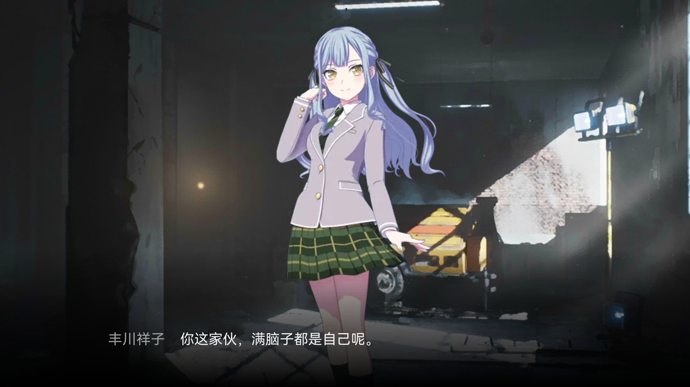

# Typst Arknights Simulator

一个基于typst，用于生成明日方舟剧情文本风格图片的小项目。

生成效果如下：



## 配置需求

1. typst 0.10.0以上
2. [HarmonyOS Sans SC](https://github.com/ajacocks/harmonyos-sans-font)字体库

## 使用方法

1. 安装typst
2. 克隆本仓库
3. 在typst代码中引用

```latex
#import "typst arknights simulator/template.typ": arknights_sim
```

4. 如果想要直接查看输出效果，可以进入`typst arknights simulator`目录，将`template.typ`中注释的代码取消注释，并运行

> typst c -f png .\template.typ "output{n}.png"

## 文件目录说明

```text
filetree 
├── README.md
├── template.typ        //模板文件
├── LICENSE.txt
├── /pics/
│  ├── ...
│  ├── dialog_background.png        //对话框黑条
│  ├── ...

```
